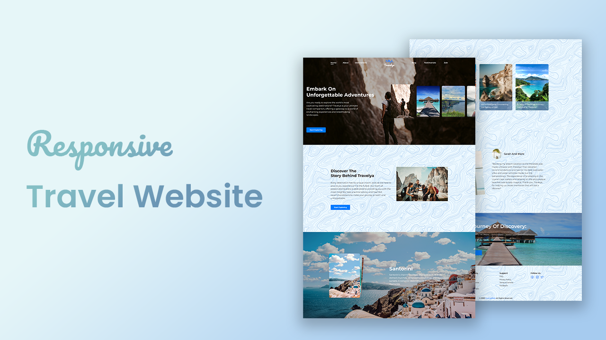

# TRAVELAY

#### 🚀 Are excited to build a travel website from scratch? You are on the right track.✨

#### [View Demo](https://travelya-codingweb.netlify.app "Travelya")

#### To start a project from scratch

-   Go to the project [repository](https://github.com/CodingWeb33/travel-website) on my GitHub page
-   Click on the green button on the top 👆
-   Click Download ZIP

#### 📚Assets

-   [Figma Design](https://www.figma.com/file/1YLRBDeqFOlPVeT4bSjfdE/Travelya?type=design&node-id=0%3A1&mode=design&t=Fggry8lhSAFEXwTB-1)
-   Icons: [Remixicon](https://remixicon.com/)
-   Font family: [Montserrat](https://fonts.google.com/specimen/Montserrat?query=montserrat)

